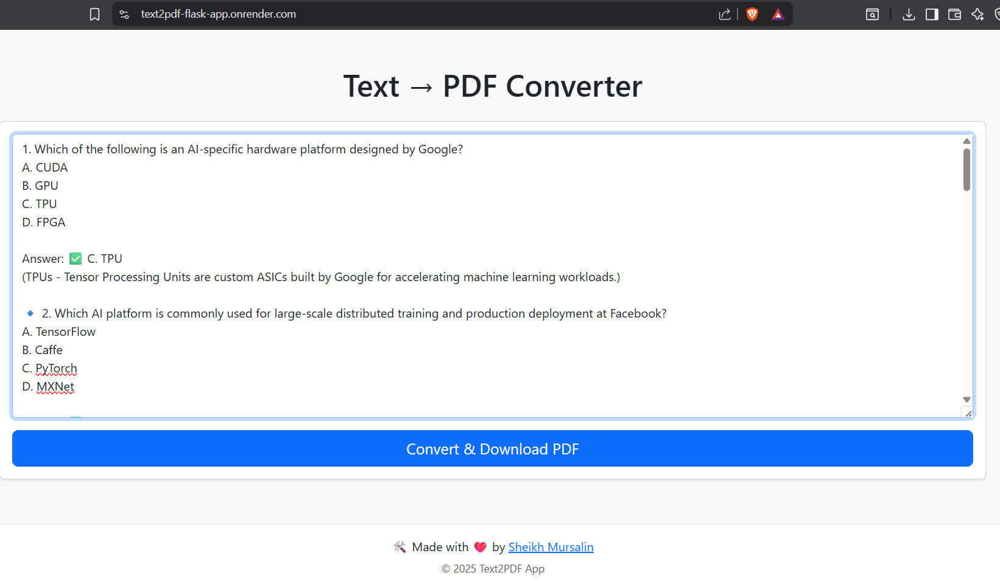

<h1 align="center">📝 Text to PDF Converter</h1>
<p align="center">
  <i>Convert your notes, blogs, MCQs — even in Hindi & emojis — to downloadable PDFs in seconds!</i><br>
  <b>Built with Python Flask • Unicode-Safe • Clean Design • Render Ready</b>
</p>

---

## 📚 Table of Contents
- [Features](#features)
- [Live Demo](#live-demo)
- [Screenshots](#screenshots)
- [Tech Stack](#tech-stack)
- [How to Run Locally](#how-to-run-locally)
- [Folder Structure](#folder-structure)
- [Deploy to Render](#deploy-to-render)
- [Sample Text to Try](#sample-text-to-try)
- [Contributing](#contributing)
- [License](#license)
- [Connect with Me](#connect-with-me)

---

## Features

- ✅ Convert long text (1000+ lines supported) to **well-formatted PDFs**
- ✅ Supports **Hindi**, **Unicode**, and emojis 🧠📚😄
- ✅ Clean layout with **smart line wrapping & spacing**
- ✅ One-click **PDF Download** button
- ✅ 💡 Ideal for MCQs, lecture notes, blogs, etc.
- ✅ 📦 Deployment-ready for platforms like **Render** and **Railway**

---

## Live Demo

🚀 **Try it live now →** [https://text2pdf-flask-app.onrender.com](https://text2pdf-flask-app.onrender.com)

<p align="center">
  <a href="https://text2pdf-flask-app.onrender.com">
    
  </a>
</p>

---

## Screenshots

### 🖥️ Demo UI Preview

<p align="center">
  
</p>

### 📄 Sample Output Preview

<p align="center">
  <video width="600" controls>
    <source src="static/gif/Demo.gif" type="gif/gif">
    Your browser does not support the video tag.
  </video>
</p>

---

## Tech Stack

| Layer      | Technology Used        |
|------------|------------------------|
| Backend    | Flask (Python)         |
| PDF Engine | fpdf2 (v2.x)           |
| Frontend   | HTML, Bootstrap 5      |
| JavaScript | Vanilla JS (Fetch API) |
| Font       | NotoSans-Regular.ttf   |
| Hosting    | Render / Railway       |

---

## How to Run Locally

```bash
# 1️⃣ Clone the repository
git clone https://github.com/yourusername/text2pdf-flask-app.git
cd text2pdf-flask-app

# 2️⃣ Create a virtual environment
python -m venv venv
source venv/bin/activate    # Linux / Mac
venv\Scripts\activate     # Windows

# 3️⃣ Install dependencies
pip install -r requirements.txt

# 4️⃣ Download required font file
mkdir -p static/fonts
curl -L -o static/fonts/NotoSans-Regular.ttf https://github.com/googlefonts/noto-fonts/blob/main/hinted/ttf/NotoSans/NotoSans-Regular.ttf?raw=true

# 5️⃣ Run the app
python app.py
```

👉 Now open: [http://127.0.0.1:5000](http://127.0.0.1:5000)

---

## Folder Structure

```
text2pdf-flask-app/
├── app.py
├── requirements.txt
├── Procfile
│
├── templates/
│   └── index.html
│
├── static/
│   ├── css/
│   │   └── styles.css
│   ├── js/
│   │   └── main.js
│   └── fonts/
│       └── NotoSans-Regular.ttf
```

---

## Deploy to Render

1. Push this repo to GitHub.
2. Visit: [https://render.com](https://render.com)
3. Create > Web Service > Connect your repo
4. Set:
   - **Build Command:** `pip install -r requirements.txt`
   - **Start Command:** `gunicorn app:app`
5. 🎉 Done! Your app is live.

---

## Sample Text to Try

```
1. Which of the following is an AI-specific hardware platform designed by Google?
A. CUDA
B. GPU
C. TPU
D. FPGA

✅ Answer: C. TPU

2. Which AI platform is commonly used for large-scale training at Facebook?
A. TensorFlow
B. Caffe
C. PyTorch
D. MXNet

✅ Answer: C. PyTorch
```

---

## Contributing

Pull requests are welcome!  
Have ideas to improve formatting or add OCR support? Open an issue or fork the repo.

---

## License

This project is licensed under the [MIT License](LICENSE).

---

## Connect with Me

<p>
  <a href="https://www.linkedin.com/in/sheikh-mursalin-bb4bb9227/" target="_blank">
    
  </a>
  <a href="https://x.com/Sheikh_Mursu" target="_blank">
    
  </a>
  <a href="mailto:er.sheikh.mursalin@gmail.com">
    
  </a>
  <a href="https://www.kaggle.com/sheikhmursalin" target="_blank">
    
  </a>
  <a href="https://leetcode.com/sheikhmursalin/" target="_blank">
    
  </a>
</p>

---

<p align="center">
  Made with ❤️ by <a href="https://github.com/sheikhmursalin">Sheikh Mursalin</a>
</p>
